# Watson Conversation Hands-on Tutorial

Implement a simple IT support help-me conversation chatbot. The chatbot helps to streamline IT support queries by automating the dialog flow.

## Business use case
The support director wants to modernize the way to support internal staff and offload his team from basic work. Currently 20000 tickets are issued in a year. 50% of the calls are answered in 7 minutes whereas there are many situations that reach up to 70 minutes for resolution. 92% of the calls are resolved by level 1 support. Employees of the Case Inc engage with customer support mostly through phones. Today, call center agents struggle to find some of the answers in a timely fashion as the systems are not integrated. This results in loss of productivity and frustration on the part of the bank employees. Level 1 support team get frustrated at times because of unavailability of the right information and proper guidance. The Level 1 support has to consult the Level 2 support team members to get some answers.   

As presented in the [Watson Conversation reference architecture diagram](https://www.ibm.com/devops/method/content/architecture/cognitiveArchitecture) this tutorial addresses the Ground Truth development with the conversation flow design (E) and the run time processing (4,7), integrated with chatbot interface (1), and controlled by the application logic - or **broker** micro service.
  

## Table of content
This tutorial was ported to the IBM Garage method tutorial at https://www.ibm.com/devops/method/tutorials/watson_conversation_support, you can execute the tasks from 1 to 7.

At the end of this training you will be able to learn the following:  
* [What is Watson Conversation (Quick Summary)](https://github.com/ibm-cloud-architecture/refarch-cognitive-conversation-broker/blob/master/doc/tutorial/README.md#watson-conversation-quick-summary)
* [Create Watson conversation service](https://www.ibm.com/devops/method/tutorials/watson_conversation_support?task=1) and [workspace](https://www.ibm.com/devops/method/tutorials/watson_conversation_support?task=2)
* [Defining intent and entities to help natural language processing](https://www.ibm.com/devops/method/tutorials/watson_conversation_support?task=3)
* [Building simple dialog flow](https://www.ibm.com/devops/method/tutorials/watson_conversation_support?task=6)
* [Using the context object for more advanced dialog](https://www.ibm.com/devops/method/tutorials/watson_conversation_support?task=7)
* [Develop hierarchical flow ](https://github.com/ibm-cloud-architecture/refarch-cognitive-conversation-broker/blob/master/doc/tutorial/README.md#a-hierarchical-dialog-flow)
* [Use variable to get data from conversation](https://github.com/ibm-cloud-architecture/refarch-cognitive-conversation-broker/blob/master/doc/tutorial/README.md#using-interaction-to-get-parameters-to-call-a-web-service)
* [Using the api](https://github.com/ibm-cloud-architecture/refarch-cognitive-conversation-broker/blob/master/doc/tutorial/README.md#task-8---using-api)


# Watson Conversation Quick Summary
To have a quick understanding of Watson Conversation, you may want to read the [product overview](https://www.ibm.com/watson/developercloud/doc/conversation/index.html) section.


As a summary, you use the Watson Conversation service to create  **chatbot**. This is the generic term for a piece of software that provides automated responses to user input. The bot is hosted in the cloud and is highly available. All the information that defines your bot's behavior is contained in a **workspace**.  

You create an **application** that enables your users to interact with the bot. The application passes user's input to the bot, possibly with some additional context information, and presents responses from the bot to the user.  

The bot is **stateless**, that is, it does not retain information from one interchange to the next. The application is responsible for maintaining any continuing information. However, the application can pass information to the bot, and the bot can update the **context** information and pass it back to the application.  

The bot uses natural language understanding and machine learning to extract meaning from the user's input. This process identifies the user's **intent**, which is the goal or purpose of the asked question. It can also identify an **entity**, which is a term, a noun that is mentioned in the input and narrow the purpose of the request. You train your bot to recognize intents and entities in the input submitted by users. To train your bot on intents, you supply lots of examples of user's input and indicate which intents they map to.

To train your bot on entities, you list the values for each entity and synonyms that users might enter.
Note: the names of intents and entities, and the text of examples, values, and synonyms, can be exposed in URLs when an application interacts with your bot. Do not store sensitive or personal information in these artifacts.
As you add information, the bot trains itself; you do not have to take any action to initiate the training.

Finally, after you train your system to recognize intents and entities, you teach it how to respond when it recognizes those intents and entities. You use the **dialog** builder to create conversations with users, providing responses based on the intents and entities that the bot recognizes in their inputs.  A dialog is composed of multiple flows and subFlows to design the multiple interactions of the conversation. Intent is supported by a dialog flow.

You should also read [Cognitive Conversation introduction](https://www.ibm.com/devops/method/content/architecture/cognitiveConversationDomain)

# Hands on lab - Step by step
As mentioned above the training was ported to the Garage Method [Tutorial section](https://www.ibm.com/devops/method/tutorials/watson_conversation_support) so you should follow the step by step instruction from this web site, but as new product capabilities were introduced since the last publish, we are specifying below some change to the tutorial that will stay here until they are ported to the tutorial.

For beginners, please perform the tasks 1 to 6. Developers can do all the tasks.


## Task 1 - Create Conversation Service
New screen shots:


## Task 2 - Creating a workspace

New screen


## Task 3 - Creating intents

New screen

  


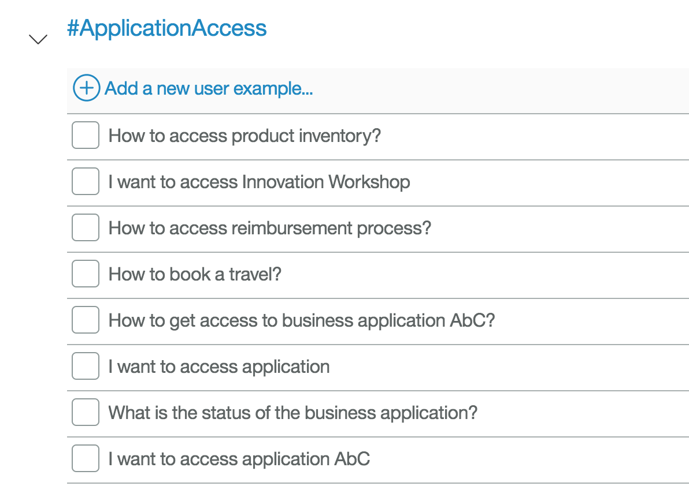  


## Task 4 - Intent Unit testing


  


## Task 5 - Adding entities  


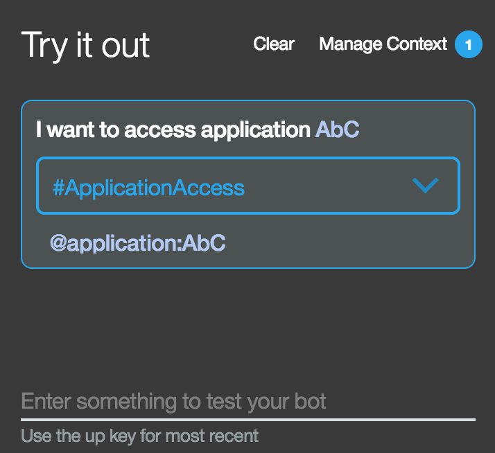

## Task 6 - Building the dialog

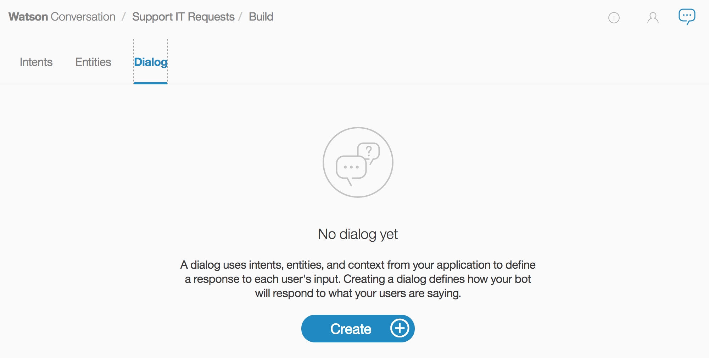  

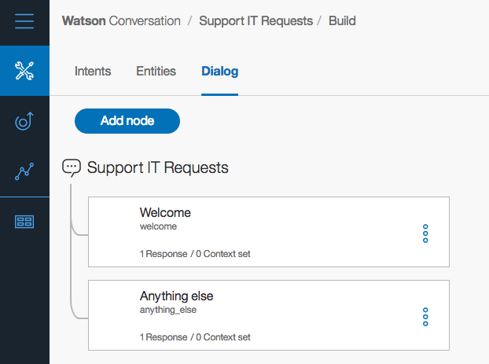  

### Defining Greetings node

The first node, named Welcome, which is executed when conversation starts. As we have defined the **#greeting** intent, your first node will be to do something when Watson Conversation classifies the user input to be a greeting. So select the `welcome` node and click to the `Add node below` menu choice:
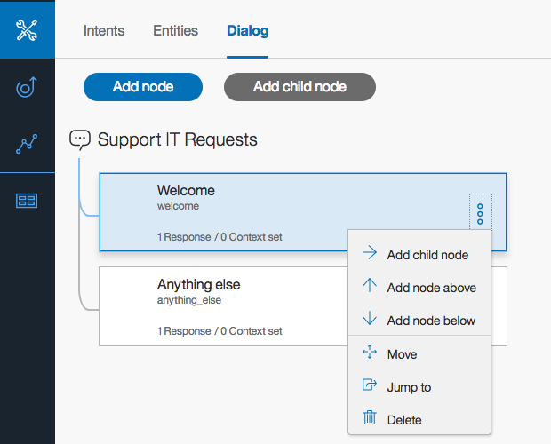


  


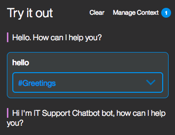

At each node level, you can expand the conversation by adding node at the same level, and the flows will be parallel or by adding a child node to create a dependent track of conversation, so the conversation branches out into a tree structure.

### Managing Anything else use case


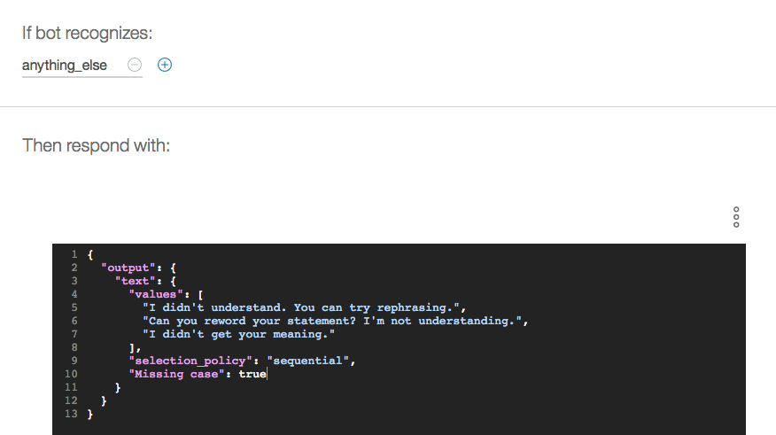

### Defining the 'access application' dialog flow
Click the "Handle Greetings" node and then click  **Add node below** menu item. Name the new node Handle application access...

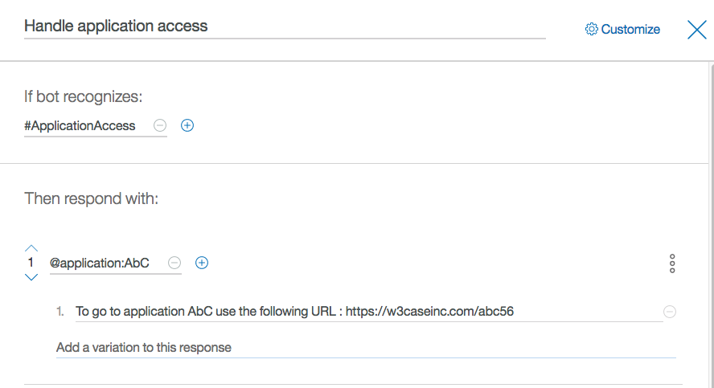


  


  


The evaluation round works in two stages. In the first stage, the dialog tries to find an answer in the child nodes of the contextual node. That is, the dialog tries to match all the conditions of the child nodes of the contextual node. If the final condition has a condition of "true," meaning that it is to be used if none of its siblings are matched, that node's response is processed.


## Task 7 - Advanced Dialog Work


### Adding variable to context
If you did not import the intents definition from the lab csv file, you need to add a new intent to support the user's query about accessing the "Supplier on boarding business process".
  

Add a new node to the dialog flow under the **Application access** node. Named it **Handling supplier on boarding**, specify the intent, **#SupploerOnBoarding** and then in the response  access the Advanced editor so we can edit the *json* response object:  


### Using slots.
In this section we will add a dialog flow to address when a user wants to bring his own device. We will support only certain brand and device. So we need to get those information. What we want to achieve could be illustrated by the following dialog:
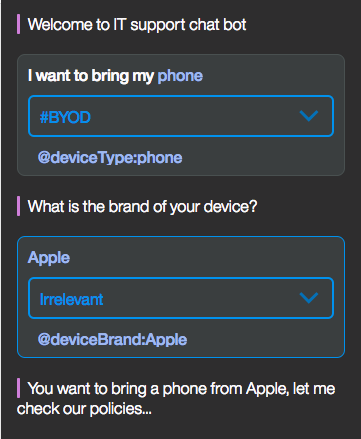
From the first query: "I want to bring my phone", Watson Conversation was able to get the **#BYOD** intent and the entity **@deviceType:phone**, so the dialog flow ask the brand of the device. If the device type was not extracted it will have ask a question about the type of device the user wants to bring.

A older way to support this different combination is to add a hierarchy of nodes and code the conditions on entity. Since the August release, there is the **slot** concept makes it more simple to implement. Use slots to get the information you need before you can respond accurately to the user.

If you did not import the intent and entities before, create a new entity for bring your own device question, like illustrated below:
  
and for the entities @deviceBrand and @deviceType:
  

  

Now add a new flow, by adding a top level node, with the `#BYOD` intent as recognize condition/ Select the Customize menu on the right to enable slots for this node:


Once done the condition part changes to **Then check for:**
  

You should be able to add 2 slots:
* Check for entity @deviceBrand, save the result in a context variable named **$deviceBrand**, and if not present ask: "What is the brand of your device?"
* Check for the entity @deviceType, saved in **$deviceType** with question: "What is the type of your device (tablet, smartphone, computer)?"

Slots make it possible for the service to answer follow-up questions without having to re-establish the user's goal.

For the response part you can use the advanced dialog to enter a output text to display the content of the device type and brand:


Be sure to set to *wait for user input* in the *And then* action part.

### Using interaction to get parameters to call a web service

As the focus is on the dialog, you must modify the previous flow to handle the 'Supplier process' intent. The first node asks whether the user wants the chatbot to trigger the process, as shown in this image:  
  

When the response is no, you use the previous behavior by providing the URL to BPM Process portal so that the user can start the process manually.
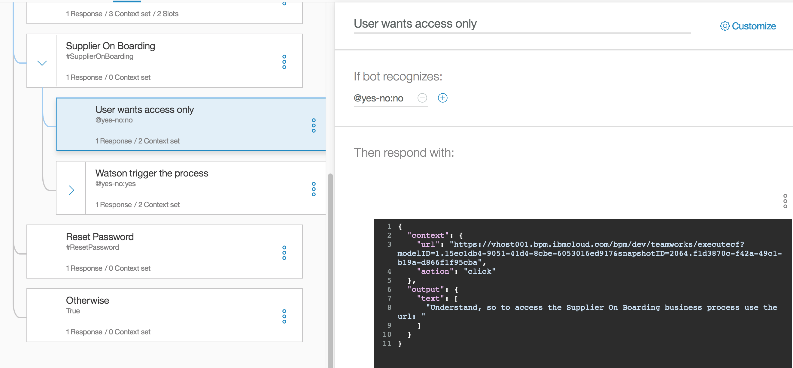

When the response is yes, the child node uses slots to get the company name and product name:
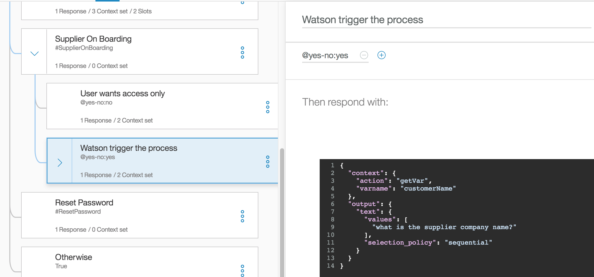  

Outside of the output.text which provides a question about the company, the context uses two variables to help driving the broker code: the action is set to getVar and the varname to the name of the variable to add to the context via code. The broker code dynamically adds the specified variable in the context to keep the data for the next interaction. The following code is in the function to manage the user's response before it calls the Conversation service:

```javascript  
if (req.body.context.action === "getVar") {
      req.body.context[req.body.context.varname] = req.body.text;
  }
```

The same approach is done in for the product name and once done the interaction set the action to **trigger**.


## Task 8 - Using API
To use API you need the service credential and use tool to preform HTTP request. See this separate [instructions](../use-apis.md).

For understanding the **broker** code see [this section of the readme](https://github.com/ibm-cloud-architecture/refarch-cognitive-conversation-broker#code-explanation)

## Learn More
* A super simple chat bot designed for customer service [here](https://www.ibm.com/blogs/watson/2016/12/build-chat-bot)
* Watson Conversation simple [Product tutorial](https://www.ibm.com/watson/developercloud/doc/conversation/tutorial.html)
